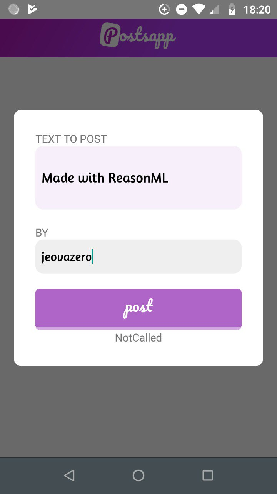
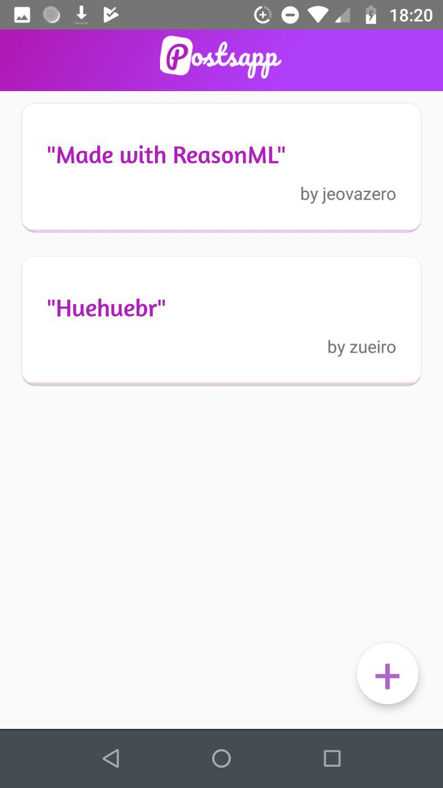

# PostsApp Mobile

A simple app to post anonymously or not a small text.

> This is a React Native application developed in Reason.

<p align="center">
  
</p>

<p align="center">
  
</p>

#### More info about the server coming soon!
> <a href="https://github.com/jeovazero/graphql-api-example"> https://github.com/jeovazero/graphql-api-example </a>

# Next Steps
- [ ] Add Reload Button to get all posts
- [ ] Add Close Button in Form to Posting

:thinking:, thinking about more...

## Install Dependencies

`yarn install`

## Run

In `src/Client.re` update the uri for used API

```js
...

/* Create an HTTP Link */
let httpLink =
  ApolloLinks.createHttpLink(~uri=" http://192.168.0.103:3001/", ());

...
```

1. `yarn watch`

2. `react-native run-android`

> Tested only on Android

## License

The source code is licensed under MIT.


Made with :smirk:
by <a href="https://github.com/jeovazero">@jeovazero</a>
